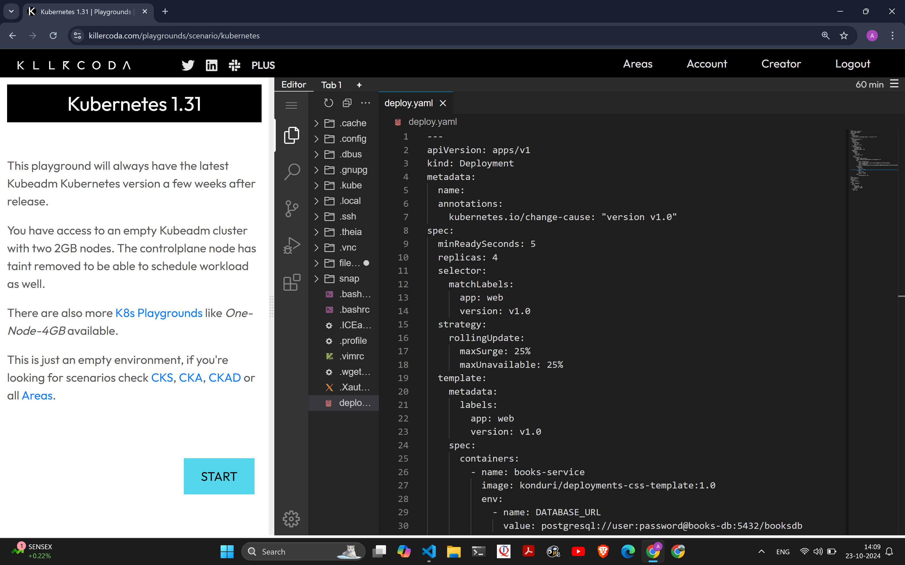
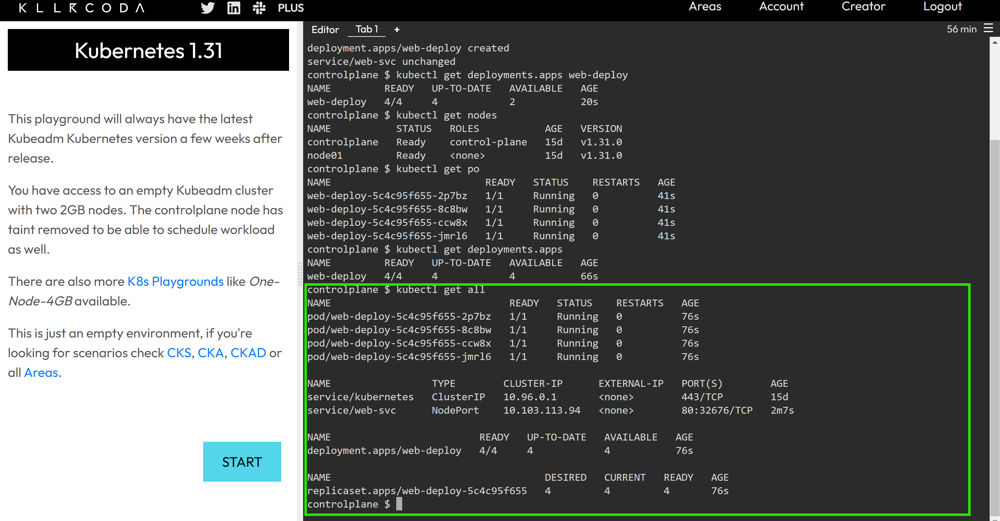
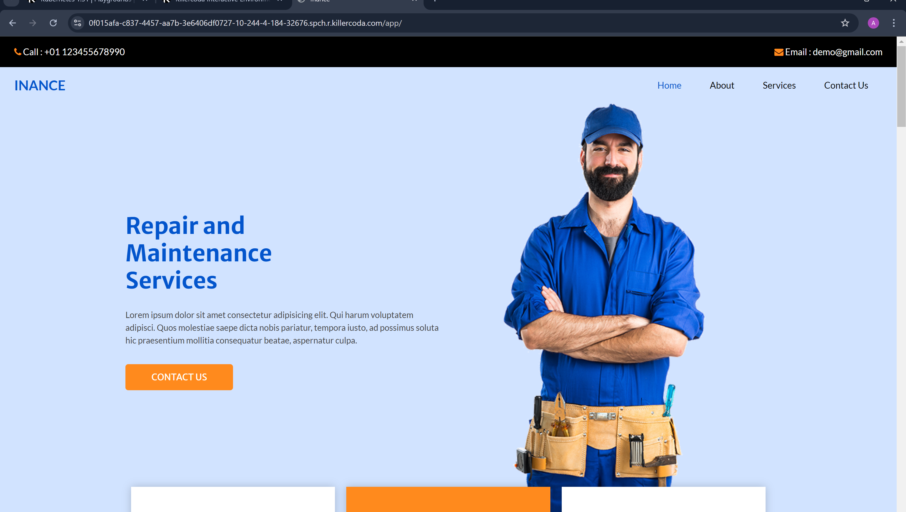
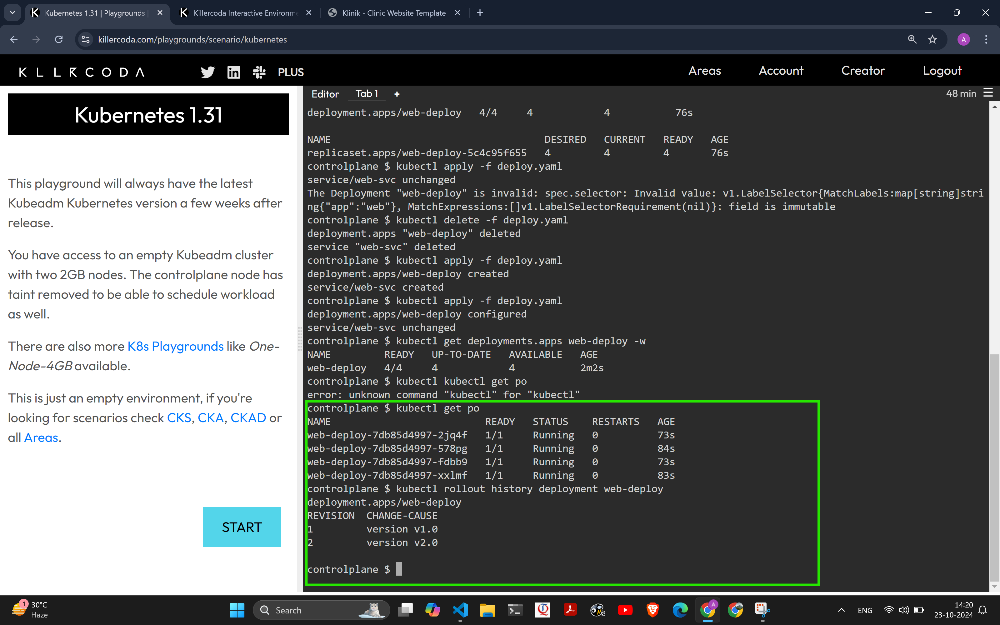
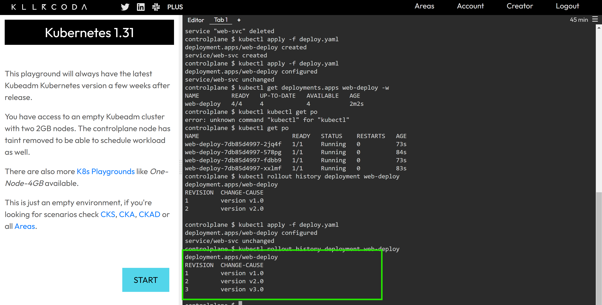
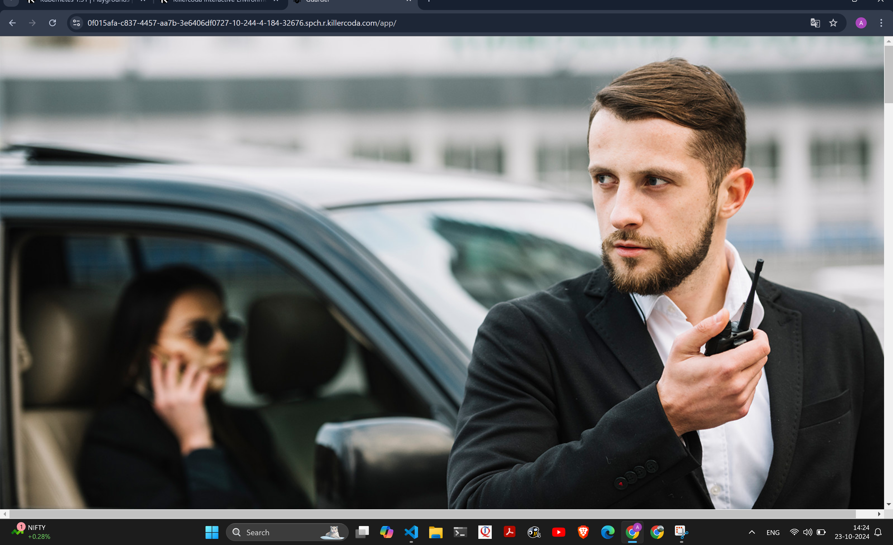
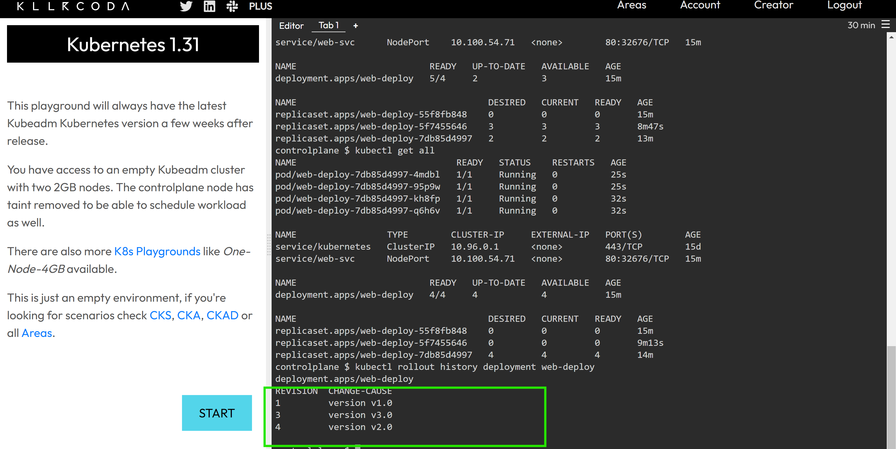

Deployments Annotations 
------------------------
* Write deployment spec 
* Use killerkoda to deploy the deployment
```sh
kubectl apply -f deploy.yaml
kubectl get all
kubectl get deployments.apps web-deploy 
kubectl rollout history deployment web-deploy
kubectl rollout undo deployment web-deploy
kubectl rollout undo deployment web-deploy --to-revision=<revision number>
```
* 
* 
* 
__change the version to v2 and apply the deployment__
* 
* 
__change the verison to v3 and apply the deployment__
* 
* 
__undo rollout to revision no2__
* 
* 